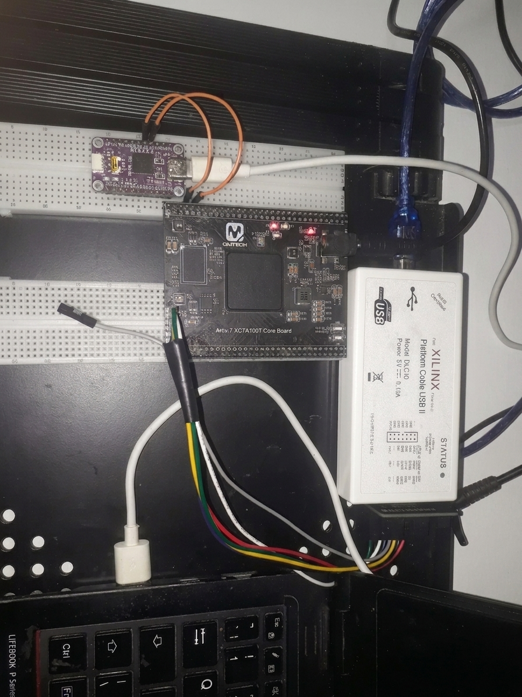
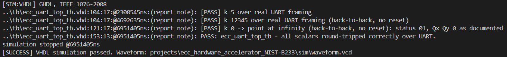
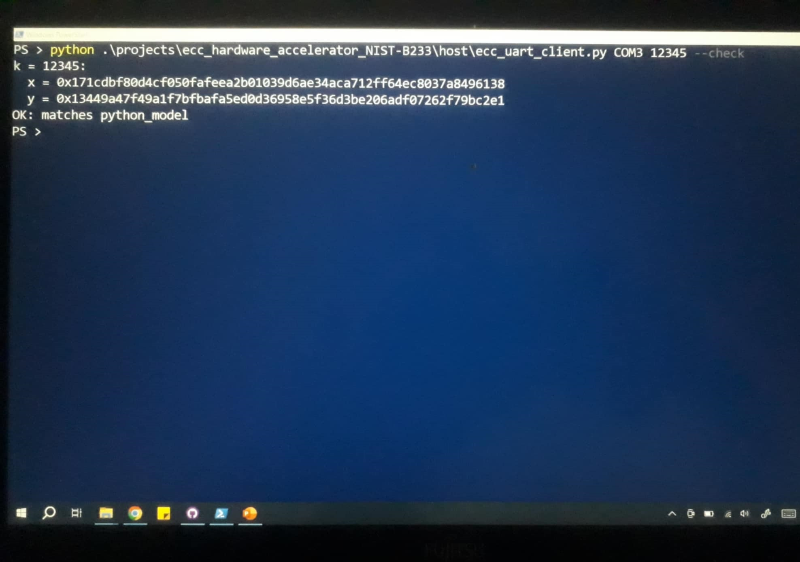

# ECC Hardware Accelerator NIST B233

## Overview
This project implements an Elliptic Curve Cryptography (ECC) hardware accelerator for the NIST B233 binary curve. It targets the Artix-7 (XC7A100T) and communicates via UART.

## Hardware Setup

## Simulation Results

## Hardware Results

## Implementation Summary
* **Device Details:** XC7A100TFGG676-1 device with a 50 MHz system clock and 115200 baud rate.
* **Timing Performance:** Worst negative slack (WNS) of 4.531 ns.
* **Resource Utilization:** 9,783 LUTs (15.43%) and 15,842 slice registers (12.49%).
* **Power Consumption:** Total on-chip power is 0.157 W with a junction temperature of 25.4°.
* **Methodology:** 0 methodology violations.

## License

[Apache 2.0](LICENSE)